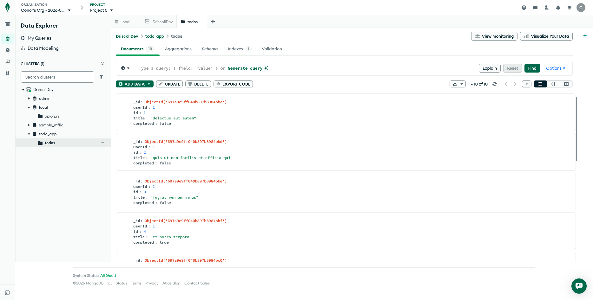

# Todo App

## Installation

Install all project dependencies:

```bash
npm install
```

## Running the Server

To start the server, run:

```bash
npm start
```

Or alternatively:

```bash
node app.js
```

## Endpoints

- `GET /todo` - Returns all todos from the MongoDB Atlas `todo_app` database, `todos` collection
- `GET /index` - Serves the index page
- `GET /read-todo` - Serves the todo list page

